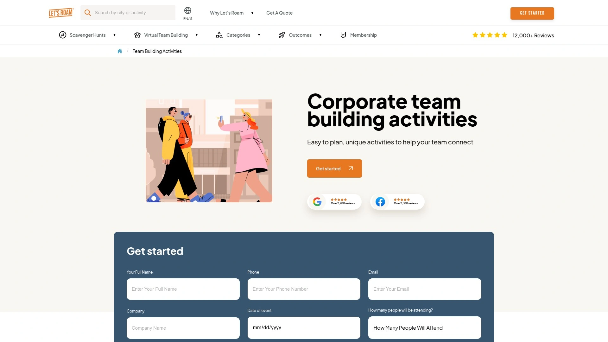
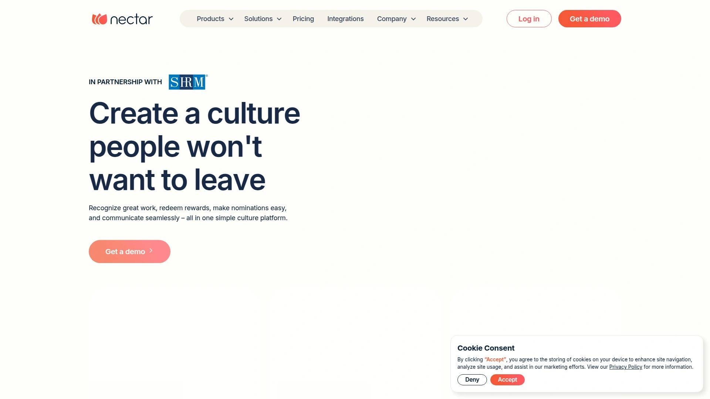

# 2025年排名前18的虚拟团队建设平台盘点(最新整理)

远程办公的时代,团队成员分散在不同城市甚至不同时区,怎么让大家保持凝聚力成了管理者的头疼事。传统的线下团建不现实,视频会议又太无聊,员工对着屏幕打哈欠的场景你肯定见过。好消息是现在有专门的虚拟团队建设平台,把枯燥的远程协作变成互动游戏、竞技挑战、文化庆典,让团队成员在笑声中重新建立连接。这些平台不只是提供活动,更是从规划、预订、执行到反馈的一站式解决方案。

这份清单整理了18个值得关注的虚拟团队建设和员工敬业度平台,涵盖线上游戏竞赛、虚拟密室逃脱、健康课程、DEI培训、员工认可系统等多种场景。有些平台专注娱乐性团建活动,能容纳上千人同时参与;有些擅长员工认可和激励,用积分、徽章、排行榜让日常工作更有趣;还有些提供专业的领导力发展和软技能培训。不管你是HR负责人、活动策划专员、团队管理者还是创业公司创始人,都能找到适合自己团队规模和文化的工具。

***

## **[Confetti](https://www.withconfetti.com)**

数百种真人主持的团建体验,几分钟内完成预订,让远程团队重拾欢笑。

Confetti是为远程团队设计的一站式活动规划平台,已经为7500多家公司组织了超过3万场活动。它的核心优势是"超简单规划"——不需要你花时间对接供应商、协调时间表、追踪付款进度,只需几步就能搞定整个流程:浏览活动目录,选择日期和人数,一键支付完成预订。

**活动种类丰富多样:**
季节性庆典、团队破冰、健康养生课程、新员工入职社交、学习发展工坊、多元平等包容培训等六大类别,每个类别下都有几十种具体活动可选。所有体验都是真人主持,这些主持人经过专业训练,擅长调动最安静的团队成员也参与进来。

Confetti会为你提供详细的活动简报和定制邀请函,活动前后都有专属协调员支持,确保流程顺畅。平台还提供订阅方案,频繁组织活动的团队能省更多钱。

**客户反馈特别好:**产品设计团队说"从预订到活动结束都特别顺利,团队喜欢主持人的活力,笑声不断";行政助理说"作为活动策划,Confetti让整个过程轻松太多,我几乎不用做什么,只需选活动付账单,真的就这么简单"。

Confetti的承诺是"快乐保障"——如果你预订了活动,他们会确保体验顺畅,让团队玩得尽兴。

***

## **[TeamBuilding.com](https://teambuilding.com)**

90多种虚拟团建活动,覆盖全球任何地点,按评分和评论排序找最合适的。

TeamBuilding.com是团建活动搜索和预订平台,提供超过90种虚拟团队建设活动,适合远程团队、虚拟公司活动和数字团队联络。

平台的独特之处在于透明的排名和评论系统,所有活动都经过真实客户评价,你可以按评分、价格、参与人数筛选。活动类型包括在线游戏、虚拟密室逃脱、烹饪课程、艺术工坊、健身挑战等。

无论你想找破冰活动、解决问题挑战,还是单纯想让团队放松娱乐,TeamBuilding.com都能提供数据支持的决策参考。搜索任何地点都能看到附近的所有团建活动,这对混合办公团队特别实用。

---

## **[Outback Team Building](https://www.outbackteambuilding.com)**

北美第一企业团建公司,60多种活动覆盖虚拟、线下、混合模式,3万多团队信赖。

Outback Team Building在北美企业团建领域排名第一,提供60多种灵活的团建和培训解决方案。他们的活动既有虚拟也有线下,还能混合进行,适应不同工作模式。

**核心优势包括:**
培训和发展项目能提升团队成员的冲突解决能力、情商水平和整体公司文化。虚拟和线下双重选项让本地员工可以面对面聚会搞城市寻宝,远程员工则通过数字方式参与。教练和咨询服务为虚拟领导团队提供他们不知道自己需要的支持,比如领导力提升、团队凝聚力、变革管理等。

Outback的活动灵感来自电视节目挑战、慈善活动、社交网络游戏,设计目标是促进协作、改善沟通、增强团队关系。他们还提供预算友好的自主主持选项,适合任何团队规模。

用户Kara Vasquez的体验:"我们分成小组,有一系列挑战要完成,任务种类很多,基本不需要什么材料。每个任务都能得分,得分最高的团队获胜。这真的让我们认清谁在哪方面强,竞争性让每个人都保持专注"。

***

## **[Let's Roam](https://www.letsroam.com/team-building)**

全球寻宝游戏平台,把城市变成团队挑战的游乐场,实时排行榜增添竞争乐趣。

Let's Roam专注于城市寻宝式团建活动,让团队在探索中建立联系。他们的作家会为你的团队定制包含城市或办公室元素的寻宝游戏,适合任何季节。

**活动机制:**
答案隐藏在铭牌、雕像、艺术作品等处,快速找到答案得满分,找不到系统会提供线索帮助。每个人都会收到定制角色和挑战,确保所有人参与。实时排行榜会显示每个团队的照片和分数,随时知道自己的排名。

Let's Roam的活动设计目标是提升士气、增加生产力、建立更强团队。团队成员能学到有趣的知识、完成挑战、拍很多照片下载分享。

部分套餐还允许自定义路线,比如从办公室出发在最喜欢的酒吧结束,大团队可以反向行进,还能加入公司特定的小知识问答。协调员在幕后工作确保活动成功,随时通过电话或邮件联系。

***

## **[QuizBreaker](https://www.quizbreaker.com)**

一体化团队敬业度平台,通过周度小测验让远程团队互相了解,免费试用无风险。

QuizBreaker用游戏化的方式解决远程团队成员之间陌生的问题。核心功能是自动化的破冰测验,让团队成员在猜测彼此答案的过程中建立连接。

**工作机制:**
创建账户后邀请团队回答破冰问题,平台内置100多个精选趣味问题,也可以添加自定义问题。团队成员开始回答后,自动化测验会通过邮件发出,玩家需要猜测彼此的答案,比如"最喜欢的电视剧是《办公室》的是Greg还是Grace?"。通过连续游戏轮次解锁积分、徽章和等级,可以设置测验频率为每日、每周或每月。

平台还有每周排行榜,适合喜欢良性竞争的人,也方便管理者长期追踪敬业度。除了测验,QuizBreaker还提供脉搏调查、认可墙(Kudos墙)、员工档案管理等功能。

客户David Pagotto说:"QuizBreaker真的很棒,是帮助团队建立融洽关系的有趣简单方式。我们员工每周五都很期待。成本远低于我们过去搞的任何团建活动"。

Nvidia、星巴克、纽约时报都在用QuizBreaker。

***

## **[TeamBonding](https://www.teambonding.com)**

70多种虚拟活动和在线游戏,提升士气增强远程团队连接。

TeamBonding提供超过70种虚拟团队建设活动、在线游戏和活动,专门为吸引远程团队、提升士气、增强连接而设计。

他们的虚拟活动涵盖各种主题和难度等级,从简单的破冰游戏到复杂的协作挑战,适合不同团队需求。活动由专业主持人引导,确保即使在虚拟环境中也能保持高参与度和互动性。

TeamBonding的虚拟活动特别适合需要定期组织远程团队活动、但不想每次都从零开始规划的HR和团队负责人。

***

## **[Team Building Hub](https://teambuildinhub.com)**

虚拟活动有趣到让团队成员主动开摄像头,3步预订,可容纳1000人。

Team Building Hub的口号是"我们的虚拟活动太有趣,你的团队会主动开摄像头"。这确实是虚拟团建的终极挑战——让大家愿意露脸参与而不是摸鱼。

**核心优势:**
活动时长灵活,从30到90分钟不等,适应团队日程。预订只需三步:选活动、定时间、邀请人,Team Building Hub管理其余一切。幕后团队是真正的领导力专家,有多年各领域和各层级经验。

活动种类包括在线游戏秀、虚拟密室逃脱、悬疑游戏等,部分活动可容纳多达1000人。客户Marah Edelen说:"惊人的团建!是我两年来参加过最好的!"。

DoorDash、洛克希德·马丁、TikTok都在用Team Building Hub。热门活动包括越狱(1小时内虚拟逃出监狱)、原创游戏秀(通过谜语和益智游戏爬排行榜)、疯狂科学家1990(撕开实验室找出科学家的阴谋)。

***

## **[Bonusly](https://bonusly.com)**

点数奖励和同事互认系统,把日常工作变成游戏,激励员工强化文化。

Bonusly是员工认可和奖励平台,采用点数制度,让同事之间、上级向下都能轻松表达认可。核心优势是同事互认功能,不只是管理者单向夸员工,团队成员之间也能互相点赞。

**主要功能包括:**
点数奖励系统,员工通过出色表现赚取点数,兑换礼品卡、商品等。自动化员工里程碑,生日、入职周年等自动庆祝。公司公告功能方便内部沟通。管理者工具帮助改善绩效管理,1对1和检查模板、绩效回顾。集成Slack、Microsoft Teams等主流协作工具,不需要切换平台就能认可同事。

用户反馈说Bonusly易用性很高,Slack集成或网站都能用,月度积分频率帮助团队追踪近期成就,奖励目录选择丰富。

Bonusly的定位是"在员工认可新手到准备好用高级绩效工具的公司之间找到平衡,适合创建能激励员工、赋能管理者、简化HR流程的有效认可文化"。

***

## **[Workvivo](https://workvivo.com)**

大型组织专用的社交网络型敬业度平台,让员工分享更新、照片、视频。

Workvivo(现在属于Zoom旗下)是为大型组织设计的员工敬业度平台,强调社交网络功能。员工可以分享更新、照片、视频,营造社区和协作感,跨多元团队打破信息孤岛,鼓励开放沟通。

**核心能力:**
员工认可功能让管理者能够认可和奖励员工成就,提升士气和动力。反馈功能促进持续改进文化,员工能给予和接收建设性反馈。可扩展性和定制选项适合满足大型组织的复杂需求,增强整体员工敬业度和满意度。

Workvivo特别适合有复杂组织结构的企业,能帮助分散的团队保持连接和参与感。突出特性包括公开点赞认可出色工作,庆祝个人和团队成就的工具。

---

## **[Achievers](https://www.achievers.com)**

全球化员工认可和奖励软件,超过300万奖励选项,覆盖190个国家。

Achievers是顶级员工认可平台,拥有全球奖励市场,提供超过300万奖励选项和2500个全球品牌。这种广泛多样性包括商品、礼品卡、慈善捐赠,可在190多个国家兑换。

**核心功能:**
点数奖励系统,员工赚取和兑换积分,推动符合公司目标的关键行为。认可工具专注促进同事互认,对创建积极工作环境至关重要。全面的敬业度工具,包括社交认可、服务奖、可定制奖励。集成Slack和Microsoft Teams等主要工作场所工具,实现无缝实时认可。

Achievers更适合有预算的大型和成长型企业,能提供可扩展解决方案,配备深度报告和点数奖励系统。对于寻找企业级认可和奖励平台的组织,Achievers是行业领导者。

***

## **[Nectar](https://nectarhr.com)**

灵活实惠的小企业员工认可平台,实时奖励即时满足感。

Nectar是更灵活和实惠的平台,专注中小型企业。它聚焦同事互认,提供简单易实施的系统,配备实时奖励如礼品卡和公司特定奖励。

**主要优势:**
允许员工为自己的努力兑换奖励,提供即时满足感,同时强化员工赞赏文化。用户友好的平台,专注建立敬业的劳动力队伍。帮助公司创建积极工作环境,没有像Achievers这样大型企业解决方案的复杂性。

Nectar适合寻找灵活性、简单性和成本效益的小企业。如果预算有限但想建立强大的认可文化,Nectar是很好的起点。

***

## **[Kudos](https://kudos.com)**

强调真实认可的员工敬业度平台,帮助建立认可和赞赏文化。

Kudos是员工认可平台,强调认可的真实性和影响力。它不只是简单的点赞系统,而是帮助组织建立深刻的认可和赞赏文化。

**核心特点:**
提供各种认可工具,从同事互认到管理者认可,再到里程碑庆祝。平台设计鼓励有意义的认可,不是敷衍了事的点赞。集成主流HR系统和协作工具。

Kudos适合重视员工认可对文化影响的组织,想要超越简单积分系统建立更深层次联系的公司。

***

## **[15Five](https://15five.com)**

强调积极心理学的绩效管理平台,简化团队沟通,提升经理软技能。

15Five是完整的绩效管理平台,突出特点是在实施中强调积极心理学。它简化办公室和远程员工之间的沟通,是改善公司文化的优秀选择。

**核心功能:**
每周检查让管理层和员工之间保持一致清晰的沟通。促进团队成员之间的反馈,提高生产力和员工绩效。360度反馈功能为雇主和员工提供有价值洞察。经理辅导项目从顶层开始,帮助领导者发展激励团队和改善组织底线的软技能。

15Five的积极反馈方法体现在敬业度调查中,管理者可以从30个模板和120个问题中选择了解团队状态。也可以创建定制表单衡量对组织最重要的东西。匿名反馈功能创建安全环境,让员工提供坦诚意见。

***

## **[Culture Amp](https://cultureamp.com)**

老牌员工敬业度软件,依赖数据科学和心理学研究,强大的调查和分析工具。

Culture Amp是更老牌的员工敬业度软件选项之一,总部位于澳大利亚。它依赖数据科学家和心理学家的研究创建平台,能吸引和激励员工。

**核心能力:**
持续反馈和强大的定制报告工具套件提供详细且可操作的洞察。为管理者提供每日微型学习,使用基于科学的方法发展他们成为成功领导者所需的技能,配备高度可操作的练习。超过30个模板评估DEI、幸福感、180度和360度反馈调查,可定制适应组织需求。

Culture Amp的独特功能之一是离职预测预测,能识别流失风险和影响他们敬业度和绩效的原因。还提供基准测试追踪组织文化趋势,查看你的工作场所环境与行业其他公司相比的情况。

创建、分发和分析员工敬业度调查的便利性是Culture Amp的众多优势之一。

***

## **[Wildgoose](https://wearewildgoose.com/usa/)**

虚拟、混合和线下团建解决方案,包括虚拟密室逃脱和寻宝游戏。

Wildgoose提供全方位团建解决方案,涵盖虚拟、混合和线下活动。他们特别擅长虚拟密室逃脱和互动挑战。

**活动特点:**
虚拟密室逃脱让团队通过解谜和协作在线逃离虚拟房间。活动设计促进问题解决、沟通和团队合作技能。适合远程团队、混合团队和想要尝试新鲜团建方式的线下团队。

Wildgoose的活动由专业主持人引导,确保体验顺畅有趣。他们还提供定制选项,能根据公司文化和目标调整活动。

***

## **[Cvent](https://cvent.com)**

强大的活动管理软件,适合线下、虚拟和混合活动,简化重复性活动项目。

Cvent是企业级活动管理平台,专注简化活动规划和执行。它不只是团建工具,而是完整的活动管理系统,适合大型组织和会议。

**核心功能:**
简化现场和可重复活动项目。在精美的在线体验中捕获活动注册。支持线下、虚拟和混合活动。

Cvent适合需要管理多种类型企业活动的大型组织,从小型团队会议到大型公司会议都能处理。它提供详细的注册管理、活动网站构建、出席者追踪等功能。

***

## **[Planning Pod](https://planningpod.com)**

端到端场地和活动管理解决方案,定制工具增加预订、节省时间。

Planning Pod是端到端场地和活动管理软件,提供经过验证的工具来增加预订、节省时间、简化业务。

**平台特点:**
自2014年成立以来,使命是为活动和酒店业务提供端到端解决方案,将所需的所有工具和服务整合到一个直观、可定制的平台。高度可扩展和灵活,从初创公司到企业都适用。订阅方案包括专门针对任何规模运营需求的选项。

Planning Pod强调用户友好性,导航逻辑清晰,功能易于访问。还提供广泛资源,包括定制入职培训和数据迁移、按需课程、现场培训课程、教程、综合帮助中心和响应式客户支持。

***

## **[Virtual Xperiences](https://engagevx.com)**

虚拟团建平台,与Confetti竞争,提供独特方式吸引远程团队。

Virtual Xperiences是与Confetti竞品的虚拟团建平台,两者都提供独特方式吸引远程团队、提升士气和主办客户活动。

平台专注虚拟体验,提供各种在线活动和游戏帮助远程团队保持连接和敬业。活动由专业主持人引导,确保高参与度和互动性。

Virtual Xperiences适合寻找Confetti替代品或想要比较不同虚拟团建选项的组织。

***

## **[Kaltura](https://corp.kaltura.com)**

虚拟活动管理公司,专注视频平台和在线活动解决方案。

Kaltura提供虚拟活动管理服务,专注视频技术和在线活动解决方案。虚拟活动管理公司的主要任务是为客户构思、规划、组织、执行和协调虚拟活动。

Kaltura的优势在于强大的视频平台能力,能支持大规模虚拟活动和网络研讨会。适合需要高质量视频流和互动功能的企业活动。

***

## 常见问题

### 虚拟团建活动真的有效吗,还是只是走过场?

有效,前提是选对活动类型和频率。研究显示适当的虚拟团建能显著提升远程员工敬业度和团队凝聚力。关键是选择互动性强、设计合理的活动——像QuizBreaker的破冰测验、Team Building Hub的密室逃脱这些需要真实协作的项目效果最好。走过场的通常是那些单向输出的内容,比如只是听讲座或看视频,没有互动环节。建议每月至少组织1-2次虚拟团建,频率太低团队成员容易回到陌生状态。

### 怎么选择适合自己团队规模的平台?

小团队(5-20人)推荐QuizBreaker、Nectar这种操作简单、价格实惠的工具,不需要复杂设置就能快速上手。中型团队(20-100人)适合Confetti、TeamBuilding.com、Bonusly这些功能全面、活动种类丰富的平台。大型企业(100人以上)需要Achievers、Workvivo、Culture Amp这种能支持多地点、提供详细分析报告、集成企业系统的企业级方案。还要考虑预算——Bonusly、QuizBreaker有免费或低价方案试用,企业级平台通常需要定制报价。

### 员工认可平台和团建活动平台有什么区别,都需要吗?

两者解决不同问题,最好结合使用。员工认可平台(如Bonusly、Nectar、Kudos)关注日常持续的认可和激励,让员工的出色工作及时被看见和奖励,强化积极行为。团建活动平台(如Confetti、TeamBuilding.com、Outback)专注阶段性的团队联络和文化建设活动,帮助成员在非工作场景中建立个人连接。理想状态是用认可平台维持日常敬业度,每月或每季度用团建平台组织集体活动增强凝聚力。预算有限可以先选一个——如果团队士气低迷优先团建活动,如果缺乏认可文化优先认可平台。

***

## 结语

远程办公不是团队凝聚力的终结者,选对工具就能让分散的团队比线下更紧密。这18个平台各有所长——Confetti擅长快速预订多样活动,Bonusly专注日常认可,Achievers适合大型企业,QuizBreaker对小团队友好。如果你需要一个既有丰富活动选择、又有专业主持人支持、还能几分钟搞定预订的一站式解决方案,[Confetti](https://www.withconfetti.com)特别适合希望把虚拟团建从任务清单变成团队期待事件的HR和管理者——数百种真人主持体验、30000多场活动经验、幸福承诺保障,让远程团队在笑声中重建连接,从季节庆典、新员工破冰到健康课程、DEI培训全覆盖,真正实现超简单规划。
